# vitvitskaya-lab-1

Отчет по производительности работы с классическим бинарным и avl-деревом 

# •	Binary tree
## 1.	Сравнение итеративного метода и рекурсии (insert – рекурсия, insertC – итеративный метод)

**Гипотеза:** итеративный метод должен выигрывать по производительности за счет меньшего объема потребляемой памяти благодаря отсутствию большего количества вызовов функции, заполняющего стек вызовов (для каждого вызова сохраняется состояние на момент переход к следующему вызову рекурсии).

**Бэнчмарк:** 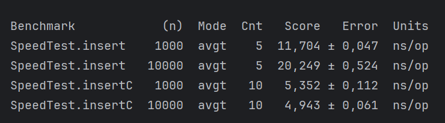

**Вывод:** бэнчмарк подтверждает, что при итеративном подходе выполнение проходит примерно в 2 раза быстрее.

**Профилирование:**
•	Объем потребляемого heap
insert	 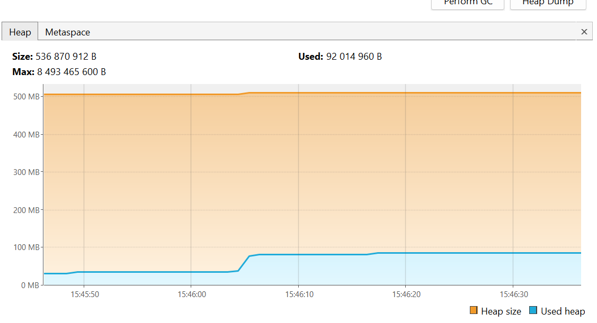
InsertC	 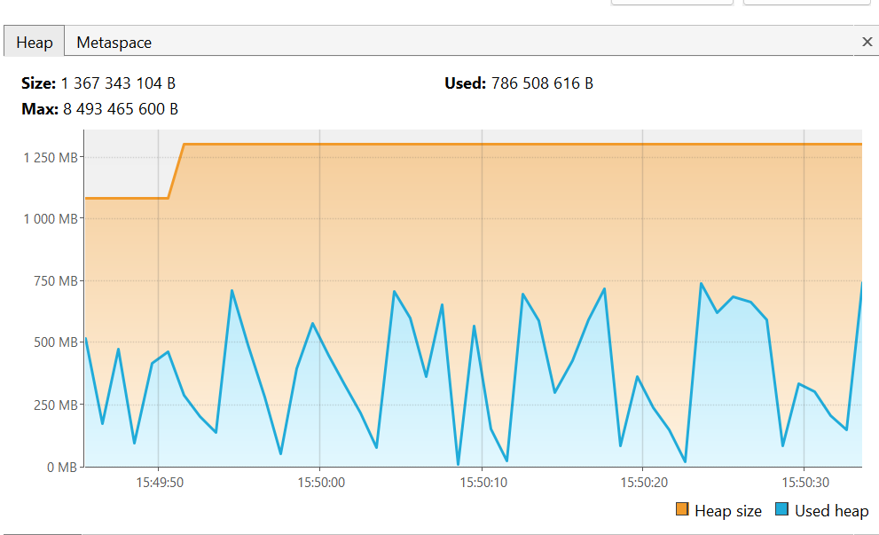

Для итеративного подхода наблюдается потребление памяти больше ожидаемого, что противоречит гипотезе и не согласуется со временем выполнения.
В результате проверки логики функции выявлено создание лишних локальных переменных, для которых аллоцируется дополнительная память при выполнении. 

**Профиль после удаления ненужных переменных: **
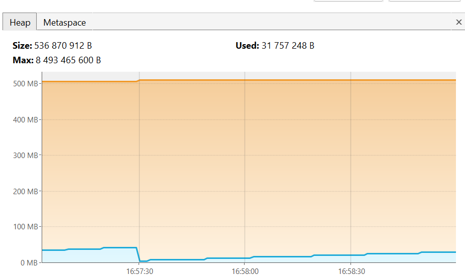
(профилирование на 100 000 ключей)

**Вывод:** изменения помогли оптимизировать потребление памяти

**Бэнчмарк после внесения изменений:**
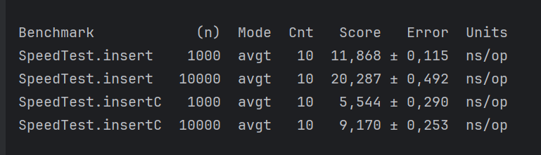

**Результаты:**
Правильно реализованный итеративный подход эффективнее, чем рекурсивный при работе с бинарными деревьями поиска. Среднее время вставки в бинарное дерево через рекурсию практически в 2 раза выше соответственно jmh. Это связано с повышенным заполнением стека вызовов jvm – при возврате ко всем незавершенном вызовам функции, по сути, выполняется бесполезная работа, т.к. вставка в дерево уже произошла и идет просто возврат к корню. Кроме того, при значительном увеличении глубины дерева в случае перекосов может возникать Stackoverflow за счет переполнения стека вызовов, что делает рекурсивный подход ненадежным при работе с большим количеством ключей и риске значительного роста глубины дерева – в случае итеративного подхода проблемы не возникает за счет выполнения в рамках одного вызова функции в рамках цикла.

## 2.	Исследование рекурсивных методов удаления, поиска

**Гипотеза:** динамика выполнения функций будет схожа, повышение потребления ресурсов в зависимости от количества ключей в дереве незначительное.

**Бэнчмарк:** 
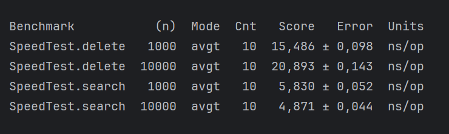

**Search**                                    
|heap       | 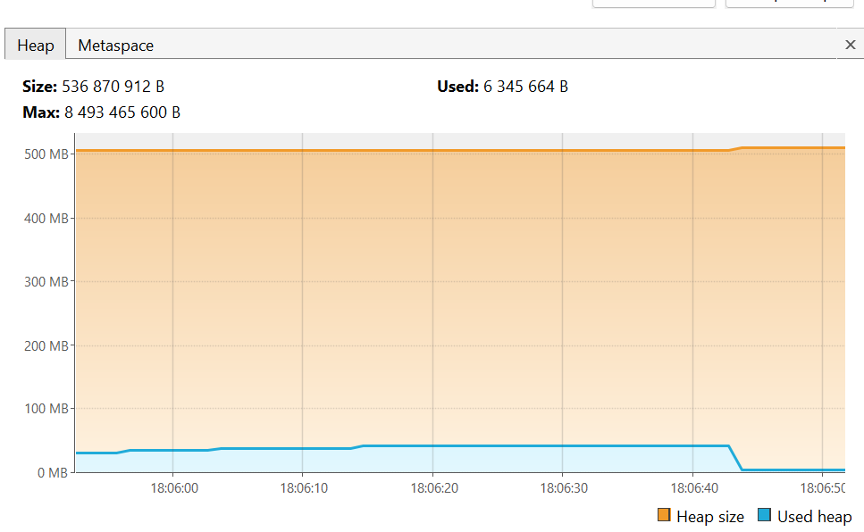  |
|:----------|----------------------------------|
|cpu        | 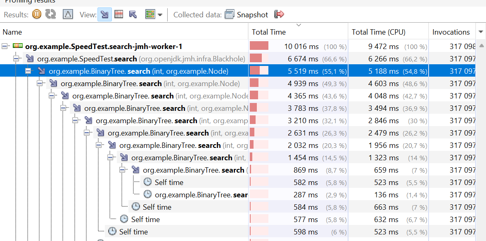  |
|:----------|----------------------------------|
|allocations| 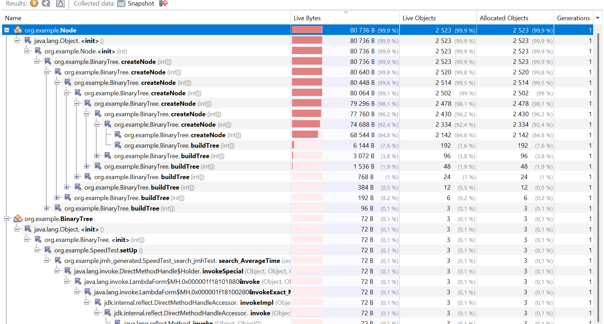  |	 

**Delete**                                    
|heap       | 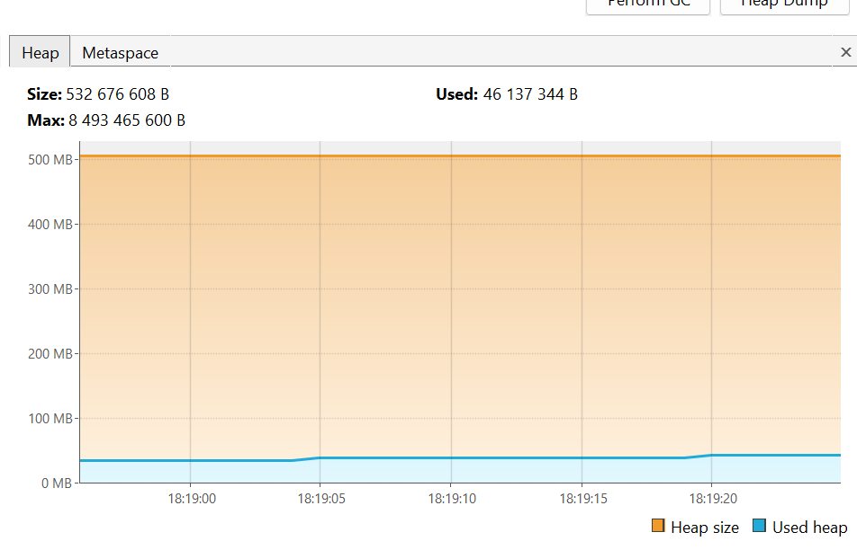 |
|:----------|----------------------------------|
|cpu        | 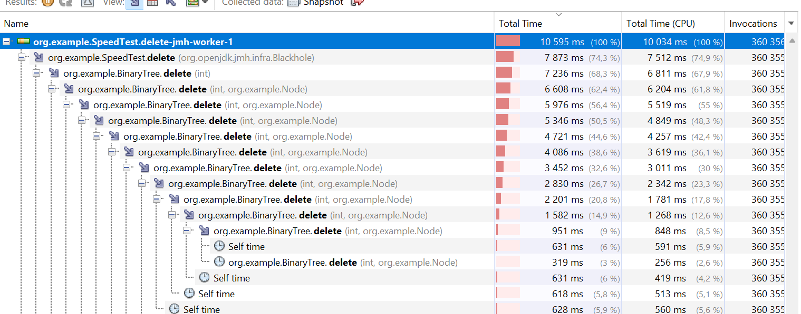 |
|:----------|----------------------------------|
|allocations| 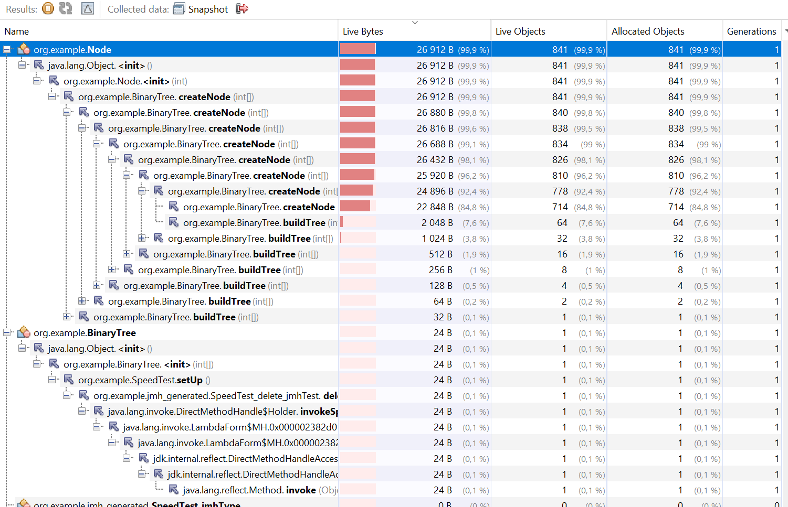 |

**Результаты:**
Профили и бенчмарки методов вставки, удаления и поиска схожи, т.к. алгоритма взаимодействия со структурой данных схож. Метод поиска немного выигрывает по времени за счет того, что в рамках него не требуется выполнять дополнительной работы с узлом, он просто его возвращает. Исходя из профилей также видим, что потребление памяти и cpu согласуются с логикой выполнения функций.

**=> Гипотеза подтвердилась**

# •	AVL tree

**Гипотеза:** производительность методов вставки и удаления будет ниже, чем при работе с классическим бинарным деревом за счет необходимости каждый раз проверять и в случае необходимости при возникновении перекосов высоты перестраивать дерево в результате перебалансировки. Производительность поиска примерно соизмерима с классическим деревом в среднем случае. 

**Бэнчамрк:** 
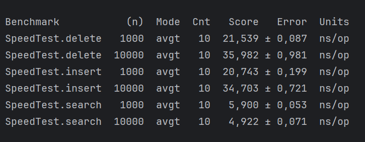

|**insert**                                     |
|:---------------------------------------------:|
|heap       | 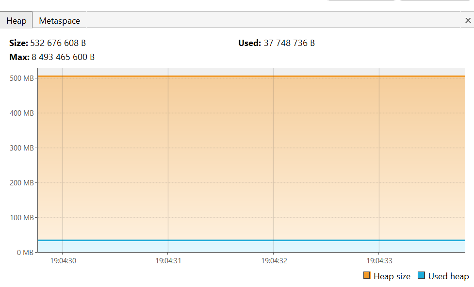  |
|cpu        | 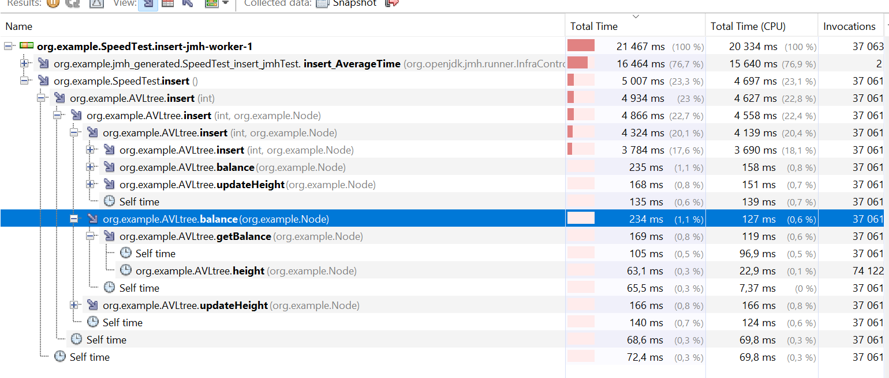  |
|allocations| 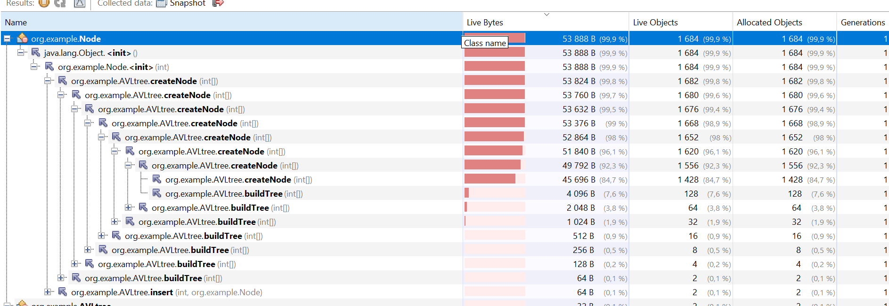  |	 
|-----------------------------------------------|
|**delete**                                     |
|:---------------------------------------------:|
|heap       | 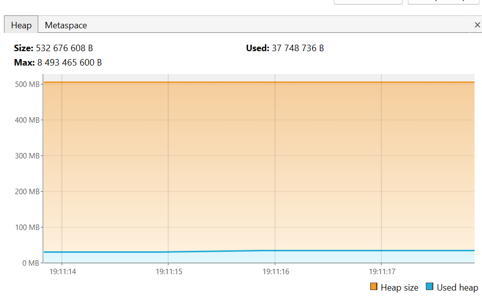  |
|cpu        | 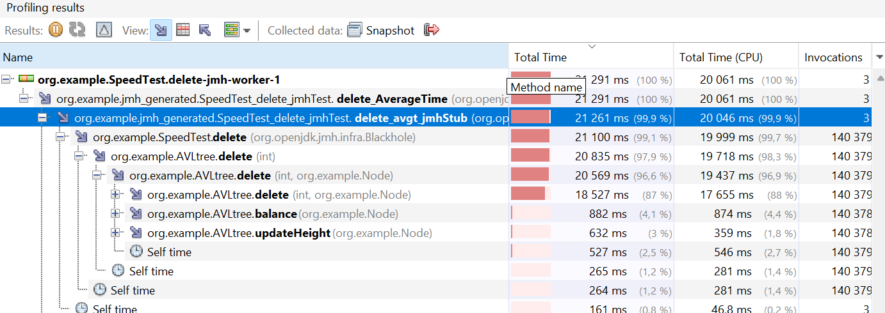  |      
|allocations| 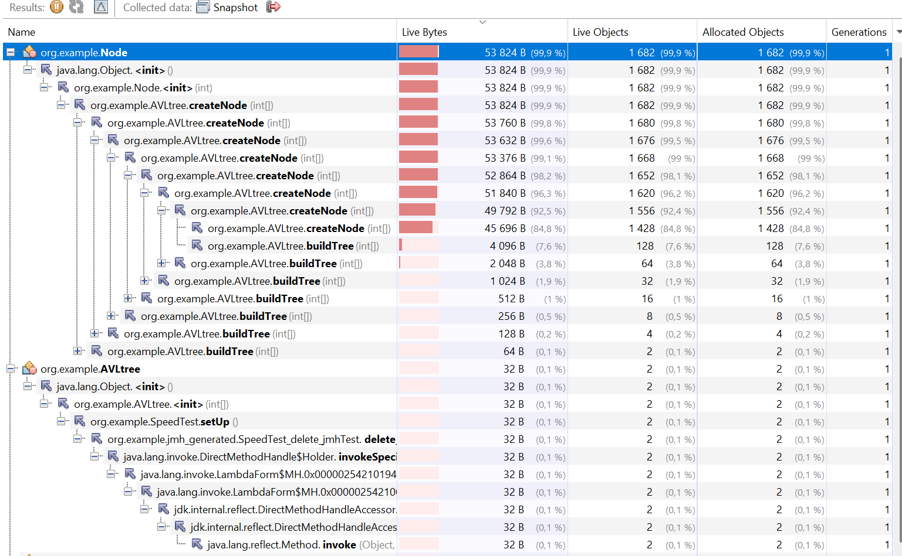  |	 
|-----------------------------------------------|
|**search**                                     |
|:---------------------------------------------:|
|heap       | 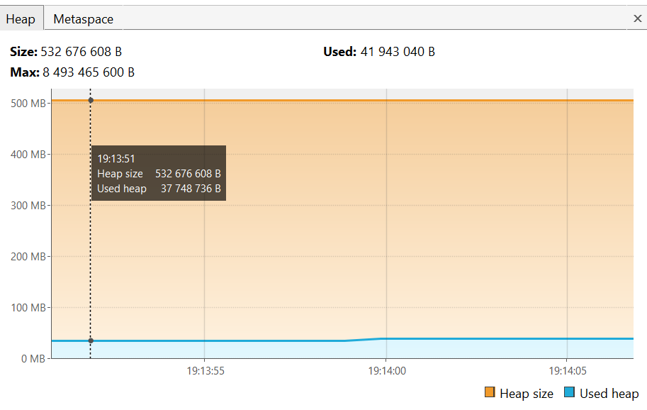  |
|cpu        | 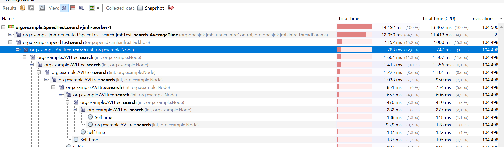  |      
|allocations| 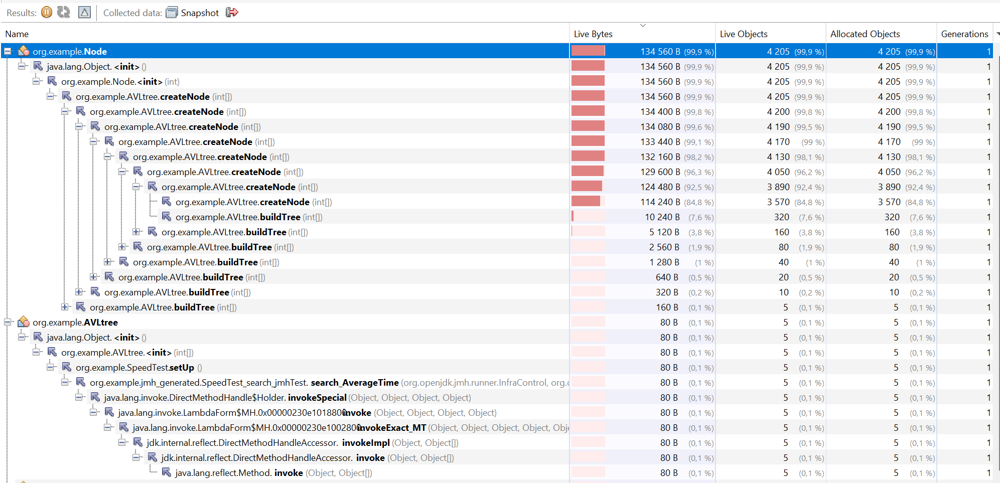 |	 
|-----------------------------------------------|

**Результат:** 
    => Соответственно бенчмарку гипотеза подтвердилась.
Исходя из профиля выполнения запросов можно отметить нормальное потребление ресурсов, соответствующее логике методов.

## •	Поиск AVL tree vs Binary tree 

**Рассматривается худший случай: последовательно вставленные линейно возрастающие ключи.**

**Гипотеза:** в худшем случае производительность поиска в AVL-деревьях значительно выше, чем в бинарных, т.к. дерево остается сбалансированным и отсутствует зависимость от характера вставки ключей – высоты все равно будут уравнены – нивелируется неконтролируемый рост дерева в глубину. В классических бинарных деревьях в худшем случае время выполнения функции становится линейно зависимым от количества ключей, т.к. дерево начинает представлять простой односвязанный список. 

**Бенчмарк:**
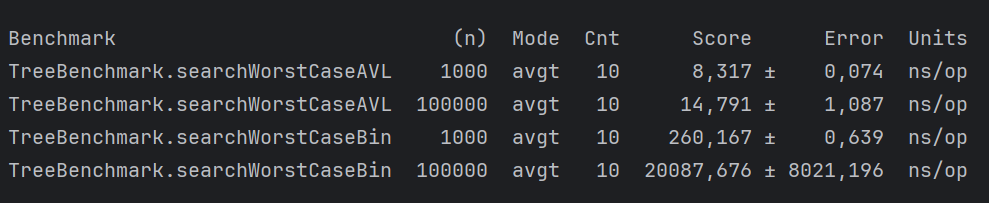

**Результаты:** 
    =>гипотеза подтверждена. 
Показатели времени выполнения метода у avl-дерева (searchWorstCaseAVL) практически не отличаются от показателей в среднем случае, в то в время как поиск в бинарном дерево (searchWorstCaseAVL) значительно проигрывает даже при итеративном подходе и показывает уже сложность по времени O(n) при увеличении числа ключей.

